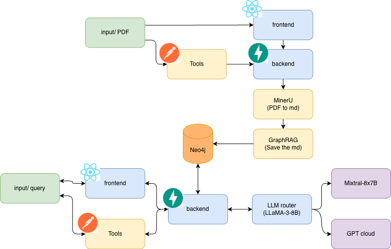

# AI Knowledge Navigator

An end-to-end AI system that transforms static PDFs into a structured knowledge graph and enables intelligent question answering using GraphRAG and LLM routing.

The platform extracts knowledge from documents, builds a Neo4j knowledge graph, and dynamically routes user queries to the most suitable reasoning pipeline to generate precise and context-aware answers.

---

## 🚀 Features

- 📄 **PDF Knowledge Extraction**
  - Convert unstructured PDF documents into structured JSON knowledge.

- 🧠 **Knowledge Graph Construction**
  - Automatically transform extracted knowledge into a **Neo4j graph database**.

- 🔍 **GraphRAG Retrieval**
  - Retrieve relevant information through graph traversal instead of traditional vector search.

- 🤖 **LLM Router**
  - Classifies user queries and routes them to the appropriate reasoning pipeline.

- 💬 **Natural Language Q&A**
  - Users can ask questions in natural language and receive context-aware answers.

---

## 🏗 System Architecture

  

### Pipeline Overview

1. **PDF Ingestion**
   - PDF documents are parsed and converted into structured JSON.

2. **Knowledge Extraction**
   - Important entities and relationships are extracted using LLM-based parsing.

3. **Knowledge Graph Construction**
   - Extracted knowledge is converted into nodes and relationships inside **Neo4j**.

4. **LLM Router**
   - Incoming user queries are classified to determine the best retrieval strategy.

5. **GraphRAG Querying**
   - The system retrieves relevant graph context and feeds it into the LLM.

6. **Answer Generation**
   - The LLM generates responses using retrieved graph knowledge.

---

## 🧩 Tech Stack

| Component | Technology |
|--------|--------|
Backend API | FastAPI |
Knowledge Graph | Neo4j |
Document Processing | Python |
LLM Integration | OpenAI API |
Retrieval | GraphRAG |
Orchestration | Python |
